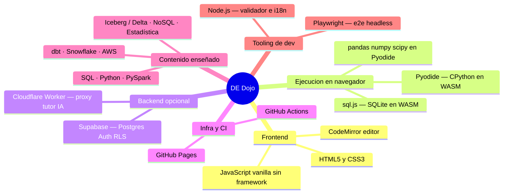
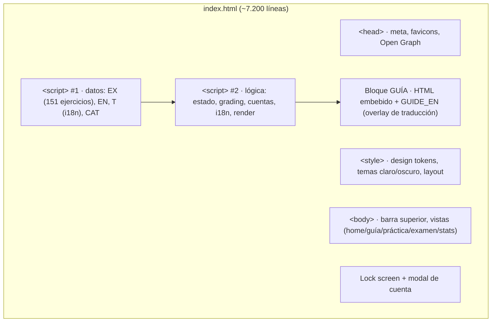
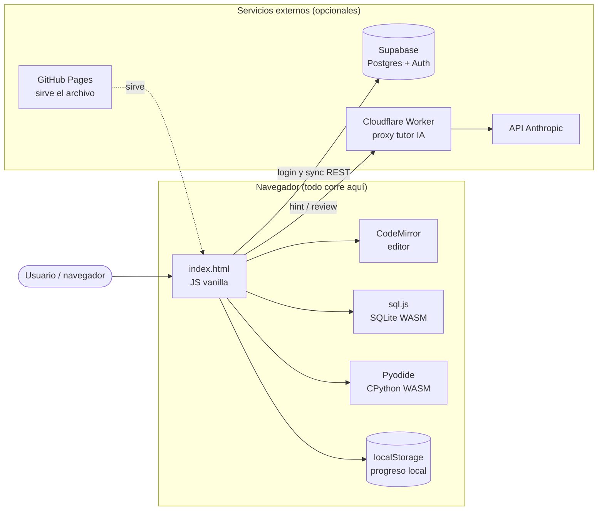
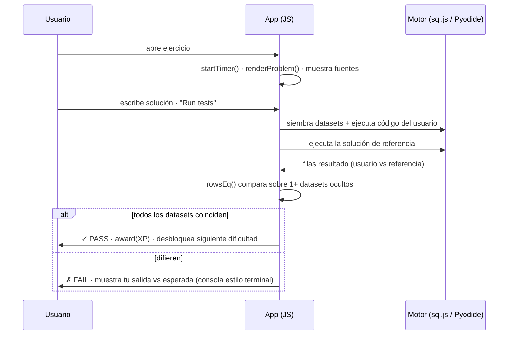
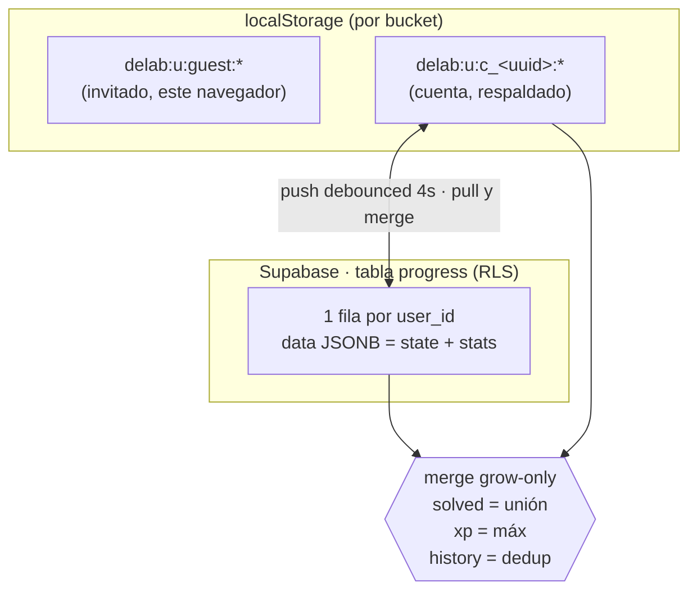
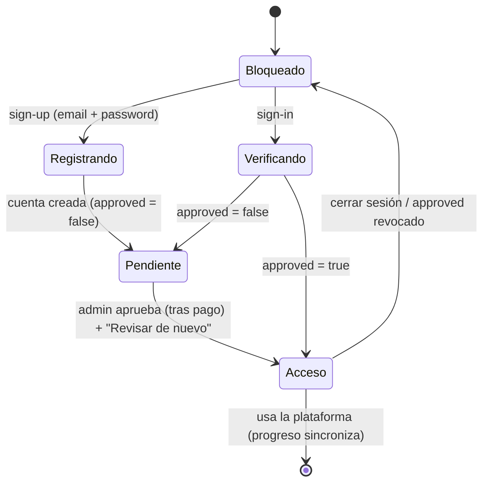
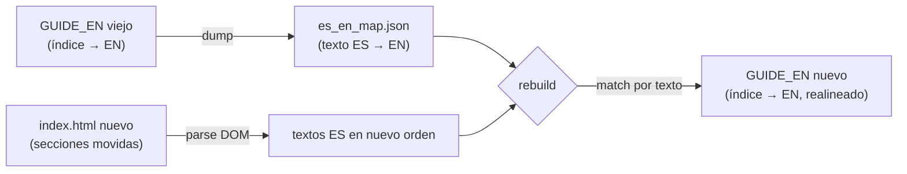
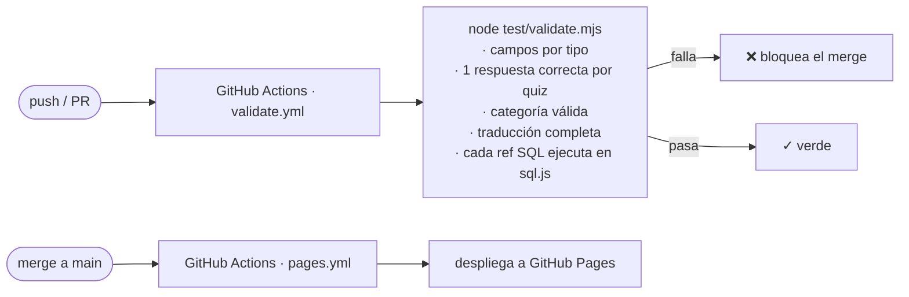

# DE Dojo — Documentación técnica y de arquitectura

> Referencia completa del repositorio `crabb-beltran/de-dojo`: qué es, con qué
> está construido, cómo está organizado y cómo funciona por dentro. Los
> diagramas son [Mermaid](https://mermaid.js.org/) y GitHub los renderiza
> automáticamente en esta página.

---

## 1. Qué es

**DE Dojo** es una plataforma web de entrenamiento para entrevistas de **Data
Engineering**. Combina dos cosas:

- Una **guía de entrevista** extensa y orientada a producción (17 secciones
  temáticas, 82+ subtemas, 9 diagramas): SQL avanzado, Snowflake, dbt, AWS,
  modelado, arquitectura lakehouse, NoSQL, estadística, seguridad y tendencias.
- Un **dojo de ejercicios ejecutables** con corrección automática por *test
  cases* reales: **151 ejercicios** (38 SQL · 47 Python · 66 quiz) repartidos
  en 20 categorías, con modos Práctica y Examen cronometrado.

Todo es una **página estática de un solo archivo** (`index.html`, ~640 KB) que
se despliega gratis en GitHub Pages. El SQL y el Python **se ejecutan en el
navegador del usuario** (WebAssembly), sin backend obligatorio.

| Aspecto | Valor |
|---|---|
| Tipo | SPA estática de un solo archivo, sin framework ni build step |
| Ejercicios | 151 (38 SQL · 47 Python · 66 quiz) · 20 categorías |
| Guía | 21 secciones `<h2>` · 82 subsecciones `<h3>` · bilingüe ES/EN |
| Ejecución | SQL vía `sql.js` (SQLite WASM) · Python vía Pyodide · en el cliente |
| Persistencia | localStorage + sync opcional a Supabase (Postgres) |
| Hosting | GitHub Pages (gratis) · CI en GitHub Actions |
| Tutor IA | Opcional, vía Cloudflare Worker (la API key nunca toca el cliente) |

---

## 2. Lenguajes y tecnologías



| Capa | Tecnología | Rol |
|---|---|---|
| **UI** | HTML5 + CSS3 (variables, grid, theming claro/oscuro) | Estructura y diseño responsive, sin dependencias de CSS |
| **Lógica** | **JavaScript vanilla** (ES2020+, sin framework ni bundler) | Toda la app: routing, estado, i18n, grading, cuentas |
| **Editor** | CodeMirror | Resaltado de sintaxis SQL/Python |
| **Motor SQL** | **sql.js** (SQLite compilado a WebAssembly) | Ejecuta las queries del usuario contra tablas sembradas |
| **Motor Python** | **Pyodide** (CPython en WASM) + pandas, numpy, scipy, sqlite3 | Ejecuta el código Python y sus tests |
| **Cuentas / sync** | **Supabase** (Postgres, GoTrue Auth, Row-Level Security) vía REST | Login, aprobación y respaldo de progreso entre dispositivos |
| **Tutor IA** | **Cloudflare Worker** → API Anthropic | Proxy serverless para que la API key quede del lado servidor |
| **CI/CD** | **GitHub Actions** + **GitHub Pages** | Validación de contenido y despliegue automático |
| **Dev tooling** | **Node.js** (validador, remap de i18n), **Playwright** (e2e) | Calidad de contenido y pruebas de navegador |

> **Nota de diseño:** cero dependencias en runtime más allá de las tres
> librerías WASM/editor que se cargan desde CDN (sql.js, Pyodide, CodeMirror).
> No hay `node_modules` en producción — `test/node_modules` es solo para el
> tooling de desarrollo.

---

## 3. Estructura del repositorio

```
de-dojo/
├── index.html                 ← LA APP COMPLETA (UI + lógica + guía + 151 ejercicios)
├── README.md                  ← visión general, features, cómo correr
├── LICENSE                    ← MIT
│
├── assets/                    ← branding e íconos
│   ├── de-dojo-icon.png           logo (tema claro)
│   ├── de-dojo-icon-dark.png      logo (tema oscuro)
│   ├── favicon.ico / favicon-16/32.png / apple-touch-icon.png
│   └── og-image.png               preview para redes sociales
│
├── docs/                      ← documentación y assets de la guía
│   ├── ARCHITECTURE.md            (este archivo)
│   ├── ACCOUNTS.md               setup de cuentas, aprobación y cobro (Supabase)
│   ├── AUTHORING.md              cómo añadir ejercicios al array EX
│   └── assets/guide-01..09.jpg   diagramas embebidos en la guía
│
├── workers/ai-tutor/          ← proxy serverless del tutor IA (opcional)
│   ├── worker.js                 Cloudflare Worker (inyecta la API key)
│   ├── wrangler.toml             config de despliegue
│   └── README.md
│
├── test/                      ← tooling de desarrollo (NO se despliega)
│   ├── validate.mjs              gate de contenido (corre en CI)
│   ├── guide_i18n.mjs            remap de traducciones por texto
│   └── package.json              deps de dev (sql.js, node-html-parser)
│
└── .github/workflows/
    ├── validate.yml              CI: valida los 151 ejercicios en cada push
    └── pages.yml                 CD: despliega a GitHub Pages al mergear a main
```

### Anatomía de `index.html`

Aunque es un solo archivo, internamente está organizado en bloques claros:



---

## 4. Arquitectura de ejecución

Lo distintivo: **no hay servidor de aplicación**. El navegador descarga el
archivo y ejecuta todo localmente; los servicios externos (Supabase, Worker)
son **opcionales y desacoplados**.



### Flujo de un ejercicio (Práctica)



La corrección es **set-based** (compara conjuntos de filas, sensible al orden
solo cuando la tarea pide `ORDER BY`) y se evalúa contra **varios datasets
ocultos** para que no baste con hardcodear la salida de muestra.

---

## 5. Modelo de datos y persistencia

Cada usuario tiene su **propio bucket** de progreso (`state` + `stats`). El
invitado usa un bucket local; una cuenta usa un bucket propio respaldado en la
nube. **Nunca se mezclan.**



- **Offline-first:** localStorage es la fuente de verdad; la nube es respaldo.
- **Merge que solo crece:** al sincronizar, `solved` se une, `xp` toma el
  máximo y el historial se deduplica → dos dispositivos nunca se borran entre sí.
- **`state`** = `{ solved, xp, streak, lastDay }` · **`stats`** = `{ history[] }`.

---

## 6. Autenticación y control de acceso (base del cobro)

La app está **restringida a usuarios registrados y aprobados**. El candado del
cliente protege la experiencia; el flag `approved` y las políticas **RLS** del
servidor protegen la sincronización — un no-aprobado no puede leer/escribir
aunque manipule el cliente.



- **`profiles`** (tabla): `approved` lo controla el admin; los usuarios solo
  pueden **leer** su fila (sin políticas de escritura).
- **`progress`** (tabla): sus políticas RLS exigen `approved = true`.
- **Cobro:** aprobación manual, o un enlace de pago (`PAY_LINK`) en la pantalla
  de pendiente (Stripe Payment Links / Lemon Squeezy), o a futuro un webhook.
- Detalle completo del setup SQL en [`ACCOUNTS.md`](./ACCOUNTS.md).

---

## 7. Internacionalización (ES/EN)

La app es bilingüe. La UI usa un diccionario `T`; los ejercicios un overlay
`EN` por id; y la **guía** usa un mecanismo especial: como es HTML estático
enorme, se traduce **por posición** con un overlay `GUIDE_EN` (1.608 entradas)
indexado al orden del documento.

El reto: al **insertar o reordenar** secciones de la guía, los índices se
desplazan y romperían la traducción. Se resuelve con un remap **por texto**
(`test/guide_i18n.mjs`), no por índice:



Así las traducciones existentes sobreviven cualquier inserción/reordenamiento;
el contenido nuevo sin traducir **degrada con gracia al español**.

---

## 8. CI/CD



- **`validate.yml`** corre en cada push/PR: extrae `EX`/`EN` de `index.html` y
  valida estructura + ejecuta **cada query SQL de referencia** con sql.js. El
  contenido roto no llega a producción.
- **`pages.yml`** publica el sitio al mergear a `main`.

---

## 9. Subsistemas clave (dónde mirar en el código)

| Subsistema | Función(es) | Qué hace |
|---|---|---|
| Datos de ejercicios | `EX[]`, `S()` | Array con los 151 ejercicios; `S()` define tablas fuente |
| Grading SQL | `runSQL()`, `rowsEq()`, `runStmts()` | Ejecuta, compara set-based sobre datasets ocultos, soporta DML/DDL con `verify` |
| Grading Python | `runPy()`, `ensurePy()` | Corre código + tests en Pyodide; auto-carga sqlite3/pandas |
| Consola | `sqlTable()`, `barChart()`, `term()`, `escv()` | Salida estilo terminal + tabla + gráfico; escapa XSS |
| Desbloqueo progresivo | `isUnlocked()`, `diffAllSolved()` | Medium bloqueado hasta pasar easy; hard hasta medium |
| Gamificación | `award()`, `xpInfo()`, `renderXP()` | XP, niveles, racha; ½ XP si venció el timer |
| i18n | `t()`, `fld()`, `applyGuideLang()`, `GUIDE_EN` | Diccionario UI + overlay ejercicios + overlay guía |
| Cuentas / gate | `gate()`, `cloudLogin()`, `refreshApproval()` | Login, aprobación, sync, buckets por usuario |
| Persistencia | `save()`, `load()`, `store`, `mergeProgress()` | localStorage + sync Supabase con merge grow-only |
| Tutor IA | `ai()` | Llama al Worker (o directo); respuesta con `textContent` (seguro) |

---

## 10. Seguridad (resumen)

| Área | Medida |
|---|---|
| XSS | Todo resultado de SQL/Python y nombres de usuario pasan por `escv()` (escapa `& < >`); la respuesta del tutor usa `textContent`, nunca `innerHTML` |
| Secretos | La app nunca contiene la API key de IA (vive en el Worker); la anon key de Supabase es pública por diseño — la protección real es RLS |
| Acceso | Login obligatorio + flag `approved` verificado en servidor vía RLS |
| Aislamiento | Buckets de progreso por usuario; invitado y cuenta nunca se mezclan |
| Ejecución de código | El código del usuario corre en el sandbox WASM de su propio navegador (sql.js/Pyodide), no en un servidor |

---

## 11. Cómo correr, probar y contribuir

```bash
# Correr localmente (cualquier servidor estático)
python3 -m http.server 8000      # → http://localhost:8000

# Validar el contenido (lo mismo que corre en CI)
cd test && npm install && node validate.mjs

# Añadir un ejercicio → ver docs/AUTHORING.md (append a EX[], sin build)
# Configurar cuentas/cobro → ver docs/ACCOUNTS.md
# Desplegar el tutor IA → ver workers/ai-tutor/README.md
```

- **Autoría de ejercicios:** [`AUTHORING.md`](./AUTHORING.md)
- **Cuentas, aprobación y cobro:** [`ACCOUNTS.md`](./ACCOUNTS.md)
- **Tutor IA (proxy):** [`../workers/ai-tutor/README.md`](../workers/ai-tutor/README.md)

---

*Documento generado como referencia técnica del repositorio. Los diagramas se
renderizan en GitHub; para editarlos, modifica los bloques `mermaid` de este
archivo.*
